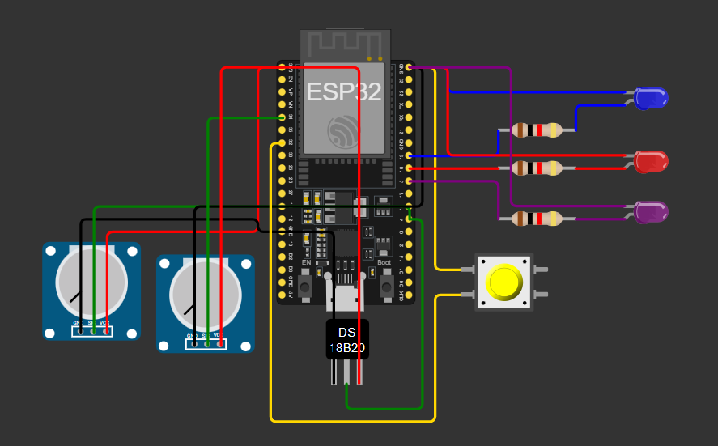

# GS2-EDGE-COMPUTING

## FuturePath: Monitoramento Inteligente do Ambiente de Trabalho com FIWARE + ESP32 

## Integrantes
- Gabriel dos Santos Cardoso (562103)  
- Gustavo Torres Caldeira (561613)  
- Lucas Oliveira Santos (563617)

## 1. Descrição do Problema

A FuturePath busca promover um ambiente de trabalho mais saudável, organizado e eficiente, apoiando colaboradores na melhoria do bem-estar e produtividade.
No entanto, para que ações inteligentes possam ocorrer, é necessário que o sistema compreenda o contexto ambiental em tempo real.

Esse módulo IoT permite:

* Monitorar temperatura e luminosidade do ambiente
* Verificar se o ambiente está adequado para foco, trabalho ou pausa
* Entender mudanças rápidas de contexto realizadas pelo usuário
* Permitir integração entre o espaço físico e a lógica de automação
* Fornecer dados reais para insights e otimizações futuras

O módulo IoT do FuturePath resolve esse desafio conectando sensores, atuadores e serviços de backend, criando uma ponte entre ambiente físico e software.

## 2. A Solução

Para representar um dispositivo físico do FuturePath, foi construído um dispositivo IoT baseado em ESP32, totalmente simulado no Wokwi, mas compatível com uso real.

O dispositivo é responsável por monitorar o ambiente, indicar modos e comunicar dados com o servidor via MQTT.

O dispositivo IoT realiza:

* Leitura de temperatura usando o sensor DS18B20
* Leitura de luminosidade via LDR
* Alternância entre modos de operação: Pausa, trabalho e estudo
* Indicação clara do modo atual usando três LEDs sendo roxo, azul e vermelho
* Envio de dados em formato JSON para o IoT-Agent MQTT
* Recebimento de comandos remotos (troca de modo e controle dos LEDs)

Esse módulo representa uma estação de monitoramento ambiental não-invasiva, que ajuda a melhorar o ambiente de trabalho sem capturar dados pessoais 


## 3. Arquitetura Geral da Solução
A solução IoT do FuturePath integra sensores físicos, comunicação MQTT e serviços em nuvem para criar um ambiente de trabalho mais saudável, produtivo e não invasivo.
```
[ ESP32 no Wokwi (Simulação do dispositivo) ]
               ↓ via MQTT (JSON)
[ Mosquitto na VM ]
               ↓
[ IoT-Agent MQTT ]
               ↓
[ Backend FuturePath / Dashboards ]
```

Componentes da Arquitetura

* ESP32 (Wokwi) → lê sensores e envia dados
* Mosquitto → recebe mensagens MQTT do dispositivo
* IoT-Agent MQTT → interpreta o JSON enviado pelo ESP32
* Backend → usa as informações para lógica de bem-estar e produtividade
* Dashboard / Ferramentas → permitem visualizar o ambiente em tempo real

A arquitetura foi projetada para ser leve, escalável e não invasiva, respeitando privacidade e garantindo insights úteis sobre o ambiente de trabalho.

## 4. Código ESP32 (Firmware – Wokwi)

O firmware implementado no Wokwi inclui:

* Conexão Wi-Fi
* Conexão MQTT com autenticação
* Leitura da temperatura (DS18B20)
* Leitura de luminosidade (LDR)
* Alternância entre os modos study, work e pause
* LEDs indicadores de modo atual
* Envio periódico de contexto
* Recebimento de comandos do IoT-Agent
* Publicação em formato JSON

 

## 5. Simulação no Wokwi

A simulação demonstra:

* Temperatura variando no sensor DS18B20
* Luminosidade sendo lida pelo LDR
* LEDs mudando automaticamente com o modo
* Envio de dados a cada 5 segundos
* Logs de eventos no Serial Monitor
* Comunicação MQTT ativa com a VM real

## 6. Tecnologias Utilizadas

**Hardware (simulado)**

* ESP32 DevKit V1
* DS18B20 (temperatura)
* LDR (luminosidade)
* LEDs de indicação

**Software**
* Wokwi Simulador
* Arduino IDE
* MQTT (Mosquitto)
* FIWARE IoT-Agent MQTT
* Docker
* VM configurada
* Postman

## Links

* Link Simulador: https://wokwi.com/projects/448149813933985793
* Link Video: https://youtu.be/h7Ia5Lkfjkc?si=ilMtHHcrQ_9SKeeu
